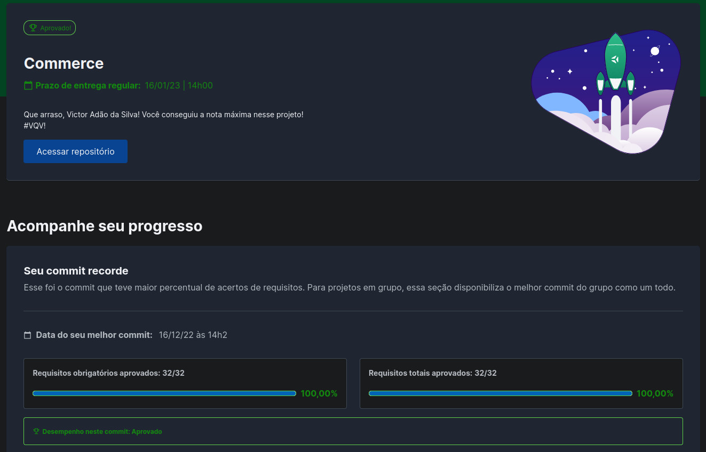

# Commerce MongoDB 🏬🎲

<!-- Escrita Sobre o Projeto -->

  
<strong>Sobre o Projeto ⚡</strong>

  
  Utilizando somente comandos NoSQL, conseguir realizar consultas e alterações na coleção "produtos" do banco commerce, utilizei a ferramenta do MongoDB para ajudar nas queries NoSQL. Foram 32 desafios passados pela Trybe e conseguir realizados todos com muita lógica e conhecimento.

<strong>Nota do Projeto ⭐</strong>
 

## Nota do Projeto ⭐⭐⭐⭐⭐

